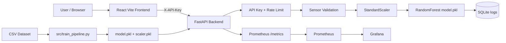
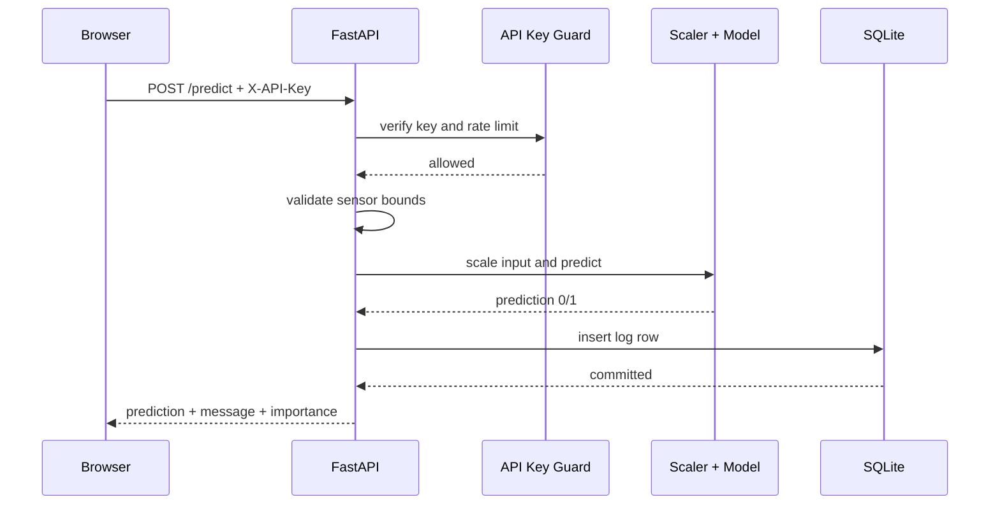
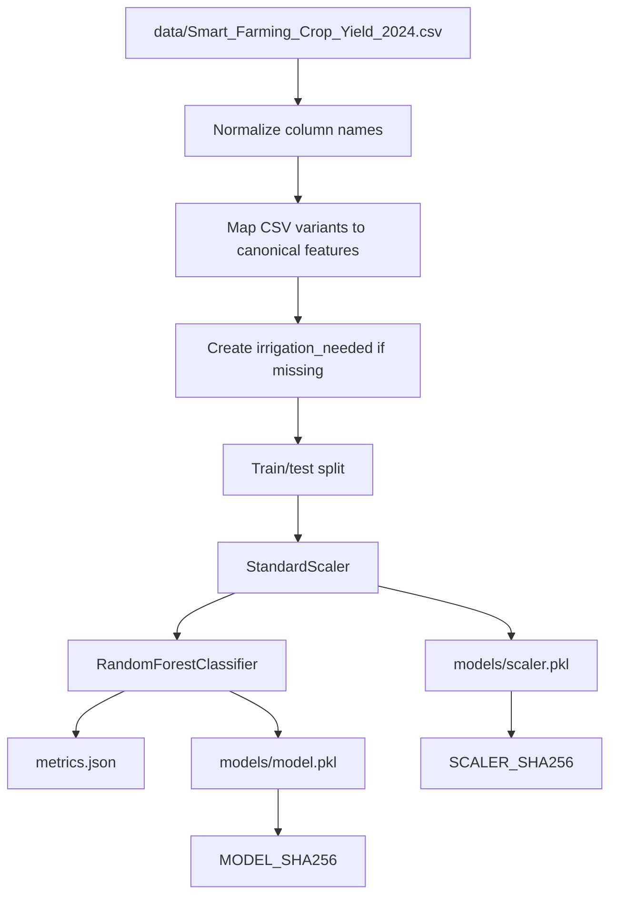
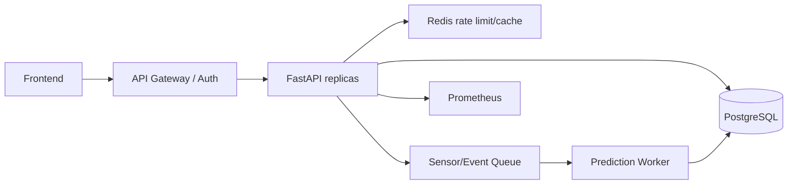

# Smart Irrigation - Technical, Functional and Security Audit

Audit date: 2026-05-11  
Project path: `C:\Users\DELL\Desktop\Irrigation`

## 1. Executive Summary

Smart Irrigation is a full-stack MLOps prototype for irrigation recommendation. It includes a FastAPI backend, a React/Vite frontend, SQLite persistence, scikit-learn model training, DVC/MLflow concepts, Docker Compose, Prometheus, Grafana, Jenkins and GitHub Actions.

The project is functional after the recent fixes:

- Protected API endpoints now require an API key.
- Model artifacts are verified with SHA-256 before `joblib.load()`.
- The ML pipeline now maps CSV columns such as `soil_moisture_%`, `temperature_C`, `rainfall_mm`, and `humidity_%` to canonical model features.
- Backend tests pass.
- Frontend production build passes.
- The training pipeline can recreate model artifacts from the CSV.

Main remaining risks:

- API key is exposed in the browser build through `VITE_API_KEY`.
- SQLite queries scan the full `logs` table and use temporary B-trees.
- `/test/simulate` writes to the production history and can pollute analytics.
- `api/train_model.py` still loads pickle/joblib artifacts without checksum verification.
- Frontend schedule/settings modules are local-only and not persisted.
- The environment is not fully reproducible on Python 3.13 because installed package versions differ from `requirements.txt`, and `mlflow` was not installed.

## 2. Scores

| Category | Score | Assessment |
| --- | ---: | --- |
| Project quality | 74/100 | Good prototype with tests, monitoring, Docker and ML pipeline, but still has production gaps. |
| Maintainability | 70/100 | Clear separation of backend/frontend/ML, but `api/main.py` is large and tests rely on fragile import paths. |
| Scalability | 54/100 | Suitable for local/small deployments; limited by SQLite, synchronous handlers and in-memory rate limiting. |
| Security posture | 62/100 | Better after API key and checksum fixes, but browser-exposed key and local pickle artifacts remain concerns. |
| Performance posture | 61/100 | Read endpoints are acceptable at small scale; prediction endpoints are relatively slow and DB queries lack indexes. |

## 3. Project Overview

The application predicts irrigation need from sensor/weather data:

- Soil moisture
- Temperature
- Air humidity
- Rainfall
- Sunlight hours

It returns a binary recommendation:

- `1`: irrigation recommended
- `0`: irrigation not recommended

Functional modules:

- Manual prediction
- Sensor simulation
- Recent history
- Daily water aggregation
- Soil moisture anomaly detection
- Frontend dashboard and controls
- Model training and artifact export
- Monitoring through Prometheus/Grafana

## 4. Architecture



## 5. Request Workflow



## 6. ML Pipeline Workflow



## 7. Technologies

Backend and ML:

- Python 3.13.7 in audited environment
- FastAPI
- Uvicorn
- Pydantic v2
- NumPy, Pandas
- scikit-learn
- joblib
- SQLite
- prometheus-client
- DVC
- MLflow intended, but not installed in this environment
- pytest

Frontend:

- React 18
- Vite 5
- JavaScript ES modules
- CSS tokens
- Native `fetch`

DevOps and monitoring:

- Docker
- Docker Compose
- Jenkins
- GitHub Actions
- Prometheus
- Grafana
- Nginx production frontend Dockerfile

## 8. Folder Structure

```text
.
|-- api/
|   |-- main.py
|   |-- database.py
|   `-- train_model.py
|-- data/
|   |-- Smart_Farming_Crop_Yield_2024.csv
|   `-- meteo.csv.csv
|-- docs/
|   |-- PROJECT_DOCUMENTATION.md
|   `-- PROJECT_AUDIT_REPORT.md
|-- irrigation_frontend/
|   |-- src/
|   |   |-- app.jsx
|   |   |-- services/api.js
|   |   |-- hooks/useData.js
|   |   |-- pages/
|   |   `-- components/
|   |-- package.json
|   |-- vite.config.js
|   |-- Dockerfile
|   `-- Dockerfile.prod
|-- models/
|   |-- model.pkl
|   `-- scaler.pkl
|-- monitoring/
|-- src/
|   |-- train_pipeline.py
|   |-- preprocessing.py
|   `-- utils.py
|-- tests/
|-- audit_logs/
|-- docker-compose.yml
|-- requirements.txt
|-- dvc.yaml
`-- params.yaml
```

## 9. Backend

Main file: `api/main.py`

Responsibilities:

- Load model/scaler artifacts.
- Verify artifact SHA-256 before `joblib.load()`.
- Enforce API key authentication on sensitive endpoints.
- Apply in-memory rate limiting.
- Validate physical sensor ranges.
- Execute model prediction.
- Persist logs to SQLite.
- Expose history, analysis, anomaly and metrics endpoints.

Important runtime behavior:

- `GET /` is public and returns a built-in HTML page.
- Protected routes require `X-API-Key` or `Authorization: Bearer <key>`.
- If `IRRIGATION_API_KEY`, `MODEL_SHA256` or `SCALER_SHA256` is missing/wrong, protected functionality fails closed.

## 10. Frontend

Main app: `irrigation_frontend/src/app.jsx`

Pages:

- Dashboard: live simulation every 5 seconds.
- Control: manual prediction form.
- Schedule: local schedule state only.
- History: API-backed history, analysis and anomalies.
- Settings: local UI settings only.

API client:

- `irrigation_frontend/src/services/api.js`
- Uses `VITE_API_URL`.
- Sends `VITE_API_KEY` as `X-API-Key`.

Important limitation: `VITE_API_KEY` is visible to browser users after build. This is acceptable only for private/internal prototypes, not public production.

## 11. APIs

| Method | Endpoint | Auth | Function |
| --- | --- | --- | --- |
| GET | `/` | No | Built-in HTML page |
| POST | `/predict` | Yes | Predict irrigation need and log result |
| GET | `/test/simulate` | Yes | Generate random input, predict and log |
| GET | `/history` | Yes | Logs from last 7 days |
| GET | `/analysis` | Yes | Daily water and irrigation aggregates |
| GET | `/anomalies` | Yes | IQR anomalies on soil moisture |
| GET | `/metrics` | Yes | Prometheus metrics |

Prediction request:

```json
{
  "soil_moisture": 45,
  "temperature": 28,
  "humidity": 60,
  "rainfall": 5,
  "sunlight_hours": 8
}
```

## 12. Database

Database: `api/irrigation_history.db`

Table: `logs`

| Column | Type |
| --- | --- |
| `id` | INTEGER PRIMARY KEY |
| `timestamp` | DATETIME |
| `soil_moisture` | REAL |
| `temperature` | REAL |
| `humidity` | REAL |
| `rainfall` | REAL |
| `sunlight_hours` | REAL |
| `irrigation_needed` | INTEGER |
| `water_used` | REAL |

Audit findings:

- Current row count during audit: 201.
- No indexes found.
- `GET /history` query plan: `SCAN logs`, plus temp B-tree for ordering.
- `GET /analysis` query plan: `SCAN logs`, plus temp B-tree for grouping.

## 13. Authentication

Implemented:

- API key via `IRRIGATION_API_KEY`.
- Accepted headers: `X-API-Key`, `Authorization: Bearer <key>`.
- In-memory rate limiting via `RATE_LIMIT_PER_MINUTE`.
- Unauthorized calls return `401`.

Remaining gaps:

- No user accounts.
- No roles.
- No session/JWT/OAuth2.
- Browser-exposed `VITE_API_KEY`.
- In-memory rate limit is not distributed across workers/containers.

## 14. Deployment

Docker Compose services:

- `api`
- `frontend`
- `mlflow`
- `prometheus`
- `grafana`

Required production variables:

```text
IRRIGATION_API_KEY
VITE_API_KEY
MODEL_SHA256
SCALER_SHA256
RATE_LIMIT_PER_MINUTE
```

Frontend production:

- `Dockerfile.prod` builds React and serves static files with Nginx.

Backend production:

- Root `Dockerfile` starts Uvicorn on port 8000.

## 15. Executed Verification

### Dependency Install and Verification

Node:

- `npm ci`: success.
- `npm ls --depth=0`: React, React DOM, Vite and plugin installed.

Python:

- Initial `pip install -r requirements.txt`: timed out after network installation attempt.
- `pytest==8.2.2`: installed successfully.
- `pip check`: no broken requirements.
- `mlflow`: not installed.
- Installed versions differ from `requirements.txt` pins:
  - FastAPI installed: `0.136.0`, required: `0.111.0`
  - NumPy installed: `2.4.4`, required: `1.26.4`
  - Pandas installed: `3.0.2`, required: `2.2.2`
  - scikit-learn installed: `1.8.0`, required: `1.5.0`
  - Uvicorn installed: `0.44.0`, required: `0.30.1`

### Tests

Command used:

```powershell
$env:PYTHONPATH='.;api'
python -m pytest -q
```

Result:

```text
61 passed, 38 warnings
```

Warnings:

- FastAPI `on_event` is deprecated.
- Pydantic `dict()` is deprecated in v2; use `model_dump()`.

### Frontend Build

Command:

```bash
npm run build
```

Result:

```text
Build successful
41 modules transformed
JS bundle: 172.36 kB, gzip 53.57 kB
CSS bundle: 10.53 kB, gzip 2.92 kB
```

Warning:

- `api.js` is both dynamically and statically imported by `useData.js`; dynamic import will not create a separate chunk.

### ML Pipeline

Command:

```bash
python src/train_pipeline.py
```

Result:

```text
Training done. Metrics: {'accuracy': 1.0, 'f1': 1.0}
```

Note: model artifacts were regenerated, so checksums changed.

Current artifact hashes:

```text
MODEL_SHA256=a8ea3279dead981fbaefb2f720381e46cb14b6a1f26ca31dbdf1b48f79ef7e39
SCALER_SHA256=d6873392ab5a3d5f81090f58d27ec0d868708e07131a5b9eb1f284e32999e040
```

### Runtime/API Performance

Network-bound Uvicorn/Vite preview startup could not be reliably probed in the sandbox, but the same FastAPI app was executed through `TestClient`. Diagnostics were written to `audit_logs/testclient_performance.json`.

| Endpoint | Status | Avg ms | P95 ms | Notes |
| --- | --- | ---: | ---: | --- |
| `/` | 200 | 30.14 | 81.51 | Public HTML page |
| `/history` | 200 | 56.50 | 192.50 | Full table scan |
| `/analysis` | 200 | 36.44 | 62.74 | Full table scan/group |
| `/anomalies` | 200 | 40.02 | 96.91 | Pandas + IQR |
| `/test/simulate` | 200 | 419.07 | 1329.42 | Writes DB each call |
| `/predict` | 200 | 583.45 | 1175.77 | Model inference + DB write |
| `/metrics` | 200 | 48.73 | 67.92 | Protected |
| `/history` without auth | 401 | 25.47 | 33.45 | Expected |

## 16. Strengths

- Clear backend/frontend/ML separation.
- Good API test coverage after fixes.
- Production build succeeds.
- ML pipeline is now reproducible from the provided CSV.
- API key protection implemented on sensitive endpoints.
- SHA-256 integrity checks before pickle/joblib loading.
- Prometheus metrics are implemented.
- Docker Compose includes API, frontend, MLflow, Prometheus and Grafana.
- DVC pipeline exists.
- Error handlers are structured and return consistent JSON.

## 17. Weaknesses

- `api/main.py` is too large and mixes API, security, metrics, HTML, model loading and prediction.
- Tests require `PYTHONPATH='.;api'`; default `pytest` collection fails.
- Browser-exposed API key is not real user authentication.
- SQLite limits production concurrency and scaling.
- MLflow dependency is intended but not available in the audited Python environment.
- Schedule/settings frontend pages are not persisted.
- API built-in HTML duplicates part of the React frontend.
- Mojibake/encoding artifacts remain in several frontend strings/comments.
- Docker image uses Python 3.9 while the audited local environment is Python 3.13.

## 18. Security Findings

| Severity | Finding | Evidence | Recommended fix |
| --- | --- | --- | --- |
| High | Browser-exposed API key | `VITE_API_KEY` included in frontend bundle | Replace with real login/session/JWT and role authorization. |
| High | `api/train_model.py` still uses unsafe `joblib.load()` | `api/train_model.py:15-16` | Remove file or add checksum verification like `api/main.py`. |
| High | No role-based authorization | One key grants all access | Add roles: read-only, operator, admin. |
| Medium | CORS allows all methods/headers | `allow_methods=["*"]`, `allow_headers=["*"]` | Restrict methods and headers to required values. |
| Medium | In-memory rate limiting | Process-local dict/deque | Move to Redis/API gateway for production. |
| Medium | npm audit: Vite/esbuild advisory | 2 moderate vulnerabilities | Upgrade Vite/esbuild carefully; breaking upgrade suggested by npm. |
| Medium | SQLite file is unencrypted | Local `irrigation_history.db` | Encrypt disk or migrate to managed DB with access controls. |
| Low | API key prompt/localStorage in built-in HTML | `localStorage` and `prompt` | Remove built-in HTML or use secure auth flow. |

## 19. Performance Findings

| Severity | Finding | Evidence | Recommended fix |
| --- | --- | --- | --- |
| High | Prediction latency is high | `/predict` avg 583 ms, p95 1176 ms | Profile model inference and DB writes; use feature-name DataFrame; consider async worker or lighter model. |
| High | Simulation pollutes DB and is slow | `/test/simulate` avg 419 ms, p95 1329 ms | Do not log simulations by default; add `source` column or separate endpoint. |
| Medium | Full DB scans | SQLite `EXPLAIN`: `SCAN logs` | Add index on `timestamp`; consider aggregate tables. |
| Medium | Pandas per request | `read_sql_query` in every history/analysis/anomaly call | Use SQL aggregation and pagination; avoid loading all rows into Pandas. |
| Medium | Dashboard polls every 5 seconds | `setInterval(fetchOnce, interval)` | Use configurable refresh, WebSocket/SSE, or cache. |
| Low | Frontend dynamic import ineffective | Vite build warning | Remove dynamic import or static duplicate. |

## 20. Database Performance Issues

Current inefficient query patterns:

```sql
SELECT *
FROM logs
WHERE timestamp >= datetime('now', '-7 days')
ORDER BY timestamp DESC
```

Observed plan:

```text
SCAN logs
USE TEMP B-TREE FOR ORDER BY
```

Recommended indexes:

```sql
CREATE INDEX IF NOT EXISTS idx_logs_timestamp ON logs(timestamp);
CREATE INDEX IF NOT EXISTS idx_logs_irrigation_timestamp ON logs(irrigation_needed, timestamp);
```

Recommended schema improvements:

- Add `source` column: `manual`, `simulation`, `sensor`, `scheduled`.
- Add pagination for `/history`.
- Add daily aggregate cache for larger deployments.
- Move to PostgreSQL for multi-user production.

## 21. Broken or Unstable Modules

| Severity | Module | Issue |
| --- | --- | --- |
| High | Test setup | `pytest` fails without `PYTHONPATH='.;api'` because tests import `main` and `database` as top-level modules. |
| High | Runtime server in sandbox | Separate Uvicorn/Vite processes could not be reliably probed over local ports in the sandbox; ASGI TestClient works. |
| Medium | `Schedule.jsx` | Data is local state only; refresh loses schedules. |
| Medium | `Settings.jsx` | Values are local state and do not update backend constants. |
| Medium | `api/train_model.py` | Legacy/insecure loader path. |
| Low | UI strings | Encoding/mojibake artifacts visible in several files. |

## 22. Code Quality and Architecture

Positive:

- Backend logic is understandable.
- Tests cover API and database behavior.
- Frontend is organized into pages, hooks, services and components.
- ML pipeline now has explicit column normalization.

Needs improvement:

- Split `api/main.py` into routers/services:
  - `api/security.py`
  - `api/model_loader.py`
  - `api/routes/prediction.py`
  - `api/routes/history.py`
  - `api/metrics.py`
- Replace Pydantic `.dict()` with `.model_dump()`.
- Replace FastAPI `@app.on_event("startup")` with lifespan.
- Make tests import `api.main` and `api.database` directly.
- Add frontend tests.
- Add typed API contracts or generated client.

## 23. Scalability Analysis

Current scalability level: local/small deployment.

Main blockers:

- SQLite write locking.
- Process-local rate limiting.
- No distributed cache.
- No queue for sensor ingestion.
- No pagination.
- Prediction writes happen synchronously in request path.
- Simulation polling can create many writes.

Recommended scalable design:



## 24. Maintainability Analysis

Maintainability is moderate-good for a prototype, but production maintainability requires:

- Module decomposition.
- Import path cleanup.
- Removal of duplicate built-in HTML or clear decision to serve React only.
- Dependency lock strategy per Python version.
- Migration scripts for database schema.
- Configuration validation at startup.

## 25. Logs and Diagnostics

Generated diagnostics:

```text
audit_logs/runtime_probe.json
audit_logs/testclient_performance.json
audit_logs/api_stderr*.log
audit_logs/frontend_stderr.log
audit_logs/frontend_static_*.log
```

Key diagnostics:

- Tests: `61 passed, 38 warnings`.
- Frontend build: successful.
- ML pipeline: successful.
- npm audit: 2 moderate vulnerabilities in Vite/esbuild chain.
- DB: no indexes; full scans.
- API auth: missing key returns `401`.

## 26. Professional Fix Plan

Priority 1:

- Replace browser API key with real authentication.
- Add role authorization.
- Fix `api/train_model.py` unsafe `joblib.load()`.
- Add DB indexes and pagination.
- Stop logging `/test/simulate` as production data.

Priority 2:

- Refactor backend into routers/services.
- Move rate limit to Redis or reverse proxy.
- Replace SQLite with PostgreSQL for production.
- Update Pydantic/FastAPI deprecated APIs.
- Fix test imports and remove `PYTHONPATH` dependency.

Priority 3:

- Add frontend tests.
- Add E2E tests.
- Add database migrations.
- Add model registry/signature process.
- Add CI jobs for frontend build, npm audit and DVC repro.

## 27. Future Improvements

- Real sensor ingestion through MQTT/HTTP.
- Weather forecast integration.
- Zone-level prediction and actuation.
- Persistent schedules and backend settings.
- Drift detection and retraining triggers.
- Model registry with signed artifacts.
- Alerting through email/SMS/webhook.
- Kubernetes deployment manifests.
- HTTPS reverse proxy.
- Observability dashboards for latency, errors, DB size and prediction distribution.

## 28. Final Audit Verdict

The project is a strong educational/prototype MLOps application. The most critical initial issues were addressed: endpoint exposure, unsafe model loading without integrity checks, and non-reproducible CSV column mapping.

It is not yet production-ready. The next professional milestone should be replacing browser-exposed API key auth with real user authentication, hardening database access, removing unsafe legacy loaders, and making deployment/runtime dependency versions reproducible.

